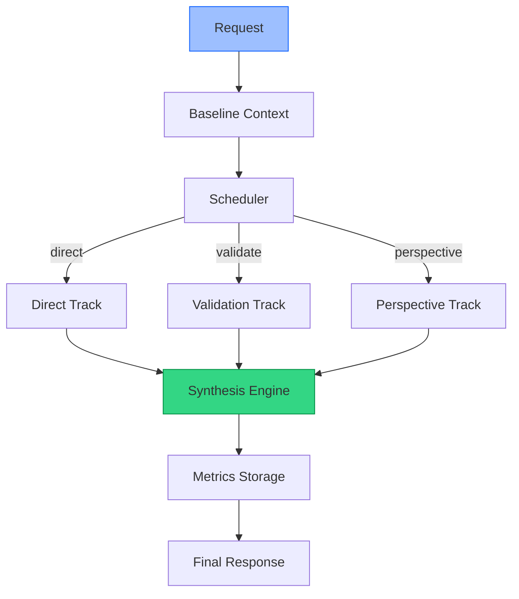

[](https://paypal.me/OtisLeesr)

# SPACE_BOUND_AI 🚀

AI Multi-Track Orchestration Framework

SPACE_BOUND_AI is an AI orchestration framework and demonstration platform that coordinates multiple reasoning tracks through a unified execution pipeline.

Instead of relying on a single model response, SPACE_BOUND_AI executes multiple reasoning paths in parallel, validates results, applies relevant analytical perspectives, synthesizes the output, and records execution metrics for later analysis.

The project is designed as a modular foundation for AI orchestration, experimentation, benchmarking, and future multi-provider deployments.

---

## Support SPACE_BOUND_AI

If SPACE_BOUND_AI helps you, please consider supporting ongoing development. Every contribution helps improve features, testing, and documentation.

Support options:

- PayPal: https://paypal.me/OtisLeesr
- Future: GitHub Sponsors, Ko-fi

---

## Key Features

- Async orchestration engine with request lifecycle management and unique request IDs
- Parallel multi-track reasoning (Direct, Validation, Perspective analysis)
- Response synthesis combining complementary tracks
- Execution timeline tracking and performance metrics
- Provider adapter framework (mock + external providers)
- Extensible configuration via YAML files
- Lightweight storage using SQLite for metrics and traces

---

## Architecture

Mermaid diagram (rendered on GitHub if Mermaid is enabled):



ASCII fallback:

```
Request
   │
   ▼
Baseline Context
   │
   ▼
Scheduler
   │
   ├──────────────┬──────────────┐
   ▼              ▼              ▼
 Direct Track   Validation   Perspective
       │              │              │
       └──────────────┴──────────────┘
                      │
                      ▼
               Synthesis Engine
                      │
                      ▼
               Metrics Storage
                      │
                      ▼
               Final Response
```

---

## Multi-Track Reasoning (Current Tracks)

- Direct Response — generates the primary answer.
- Validation — evaluates consistency, confidence, context drift, contradictions, and overall quality.
- Perspective Analysis — applies relevant viewpoints such as engineering, scientific, business, security, legal, ethics, UX, operations, education, risk analysis, and system design.

Each track runs asynchronously, and results are synthesized to produce a higher-quality final response than a single-model call.

---

## Technology Stack

Backend
- Python 3.10+
- FastAPI
- AsyncIO
- Pydantic
- SQLite
- PyYAML
- Uvicorn

Frontend
- React
- TypeScript
- Vite

Testing
- Pytest
- FastAPI TestClient
- Async testing patterns

---

## Repository Structure

SPACE_BOUND_AI/

- app/
- benchmarks/
- config/
- docs/
- storage/
- tests/
- util/
- web/

Files
- main.py
- requirements.txt
- README.md
- LICENSE

---

## Installation

Requirements
- Python 3.10+
- Node.js 18+
- npm

Backend

```bash
python -m venv .venv
# macOS / Linux
source .venv/bin/activate
# Windows (PowerShell)
# .\.venv\Scripts\Activate.ps1

pip install --upgrade pip
pip install -r requirements.txt
```

Frontend

```bash
cd web
npm ci
npm run build
cd ..
```

---

## Running SPACE_BOUND_AI (Local)

Start the backend:

```bash
uvicorn main:app --reload --host 0.0.0.0 --port 8000
```

Then open: http://localhost:8000

The frontend dashboard (if built) will provide a web-based demo UI.

---

## API Endpoints

Method | Endpoint | Description
---|---|---
GET | /health | Service health
GET | /providers | Available providers
GET | /tracks | Active reasoning tracks
GET | /config | Current configuration
GET | /metrics | Stored metrics
POST | /chat | Run orchestration pipeline

Example request body:

```json
{
  "prompt": "Explain quantum computing simply."
}
```

Notes
- The default provider is the built-in mock adapter, allowing the project to run without external API keys.

---

## Model Adapter Framework

Supported adapters (current & planned):
- Mock (default)
- OpenAI
- Anthropic
- Gemini
- Ollama (planned/optional)
- LM Studio (planned/optional)
- Llama-compatible providers (planned/optional)

Common adapter interface (expected methods):
- generate()
- stream()
- health_check()
- token_usage()

External providers require their respective API keys, typically set via environment variables such as:

- OPENAI_API_KEY
- ANTHROPIC_API_KEY
- GEMINI_API_KEY

---

## Metrics & Storage

Execution data is stored in SQLite (storage/). Tracked information includes:
- Request ID
- Timestamp
- Provider
- Latency
- Validation score
- Confidence
- Cost estimate
- Token usage
- Perspective results

These metrics enable benchmarking, observability, and later analysis.

---

## Automated Testing

Current repository verification:

Test File | Tests
---|---
tests/test_api.py | 8
tests/test_core_additional.py | 24
tests/test_engine.py | 15

Total: 47 tests

Verification Status
- ✅ 47 tests passed (as documented)
- ✅ 0 failed
- ✅ Backend verified
- ✅ Mock adapter verified
- ✅ API endpoints verified

Run the test suite:

```bash
PYTHONPATH=. pytest tests/ -v
```

---

## Dashboard

The React dashboard provides:
- Prompt input and demo mode
- Engine execution and timeline
- Validation results and perspective analysis
- Metrics and execution history
- Provider configuration and status

Build the frontend:

```bash
cd web
npm ci
npm run build
```

---

## Configuration

Configuration files:
- config/base.yml
- config/tracks.yml
- config/scheduler.yml
- config/providers.yml
- config/dashboard.yml

The default configuration uses `provider: mock`. No API credentials are required for local development unless you switch to an external provider.

---

## Roadmap

Planned and aspirational enhancements:
- Authentication and access controls
- Expanded benchmark suite
- Additional model providers and adapters
- Distributed execution and scaling
- Advanced validation checks and automated remediation
- Enterprise observability and integrations
- Production deployment tooling and examples

---

## Contributing

Contributions are welcome! Please open issues for bugs or feature requests, and submit pull requests for fixes and improvements.

Suggested workflow:
1. Fork the repo
2. Create a feature branch
3. Add tests for new behavior
4. Open a pull request describing your change

---

## License

Licensed under the Apache License 2.0. See the LICENSE file for details.
