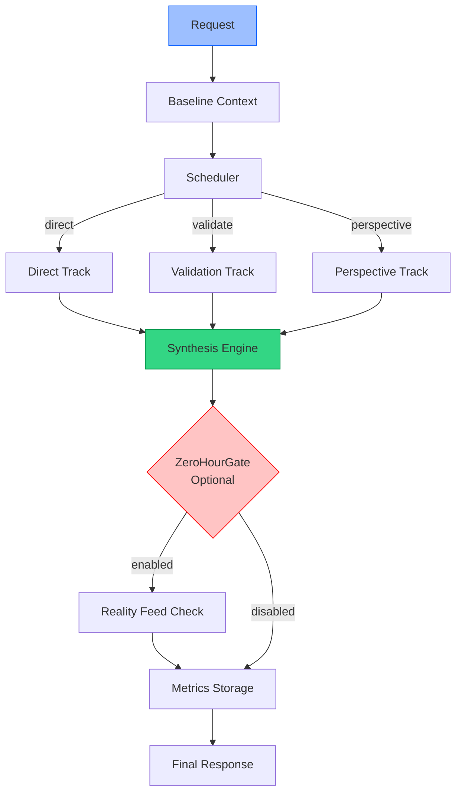

[](https://paypal.me/OtisLeesr)

# SPACE_BOUND_AI 🚀

## AI Multi-Track Orchestration Framework

SPACE_BOUND_AI is an asynchronous AI orchestration engine designed to improve response quality by coordinating multiple reasoning stages before delivering a final answer.

Instead of treating latency as wasted time, SPACE_BOUND_AI intentionally uses an "Afterthought Window" to perform validation, perspective generation, and synthesis concurrently.

The objective is not to replace existing LLMs.

The objective is to orchestrate them.

SPACE_BOUND_AI executes multiple reasoning paths through a unified execution pipeline, validates results, applies analytical perspectives, synthesizes responses, and records execution metrics for [...]

The project is designed as a modular foundation for AI orchestration, experimentation, benchmarking, and future multi-provider deployments.
---

## Support SPACE_BOUND_AI

If SPACE_BOUND_AI helps you, please consider supporting ongoing development. Every contribution helps improve features, testing, and documentation.

Support options:

- PayPal: https://paypal.me/OtisLeesr
- Future: GitHub Sponsors, Ko-fi

---

## Key Features

- Async orchestration engine with request lifecycle management and unique request IDs
- Parallel multi-track reasoning (Direct, Validation, Perspective analysis)
- **Real validation engine** with confidence scoring (0-100) and drift detection
- **Multi-perspective analysis** across 12 distinct viewpoints (engineering, scientific, business, security, ethics, legal, UX, operations, education, risk, design, economic)
- Response synthesis combining complementary tracks
- Execution timeline tracking and performance metrics
- **Provider adapter framework** with full implementations for OpenAI, Anthropic, Gemini, plus mock for testing
- Extensible configuration via YAML files
- Lightweight storage using SQLite for metrics and traces
- **Reality Feed system** for live state verification (optional, can be enabled for safety-critical systems)
- **ZeroHourGate collision detection** (optional, disabled by default to not interfere with standard operations)

---

## Architecture

Mermaid diagram (rendered on GitHub if Mermaid is enabled):


```mermaid
flowchart TD
  A[Request] --> B[Baseline Context]
  B --> C[Scheduler]
  C -->|direct| D[Direct Track]
  C -->|validate| E[Validation Track]
  C -->|perspective| F[Perspective Track]
  D --> G[Synthesis Engine]
  E --> G
  F --> G
  G --> H{ZeroHourGate<br/>Optional}
  H -->|enabled| I[Reality Feed Check]
  I --> J[Metrics Storage]
  H -->|disabled| J
  J --> K[Final Response]
  style A fill:#0b5fff66,stroke:#0b5fff,stroke-width:1px
  style G fill:#00cc66cc,stroke:#008f44,stroke-width:1px
  style H fill:#ff6b6b66,stroke:#ff0000,stroke-width:1px
```

ASCII fallback:

```
Request
   │
   ▼
Baseline Context
   │
   ▼
Scheduler
   │
   ├──────────────┬──────────────┐
   ▼              ▼              ▼
 Direct Track   Validation   Perspective
       │              │              │
       └──────────────┴──────────────┘
                      │
                      ▼
               Synthesis Engine
                      │
                      ▼
            ZeroHourGate (Optional)
                      │
                      ▼
               Metrics Storage
                      │
                      ▼
               Final Response
```

---

## Multi-Track Reasoning (Current Tracks)

- **Direct Response** — generates the primary answer using the selected provider.
- **Validation** — evaluates answer completeness, confidence (0-100), conceptual drift, and quality signals. Real implementation with dynamic scoring.
- **Perspective Analysis** — applies 12 distinct analytical viewpoints:
  - Engineering (feasibility, performance, scalability)
  - Scientific (methodology, evidence, accuracy)
  - Business (ROI, market fit, viability)
  - Economic (cost-benefit, financial impact)
  - Security (vulnerabilities, threat model, protection)
  - Legal (compliance, liability, IP)
  - Ethics (bias, fairness, social impact)
  - User Experience (usability, accessibility, satisfaction)
  - Operations (implementation, maintenance, support)
  - Education (learning curve, documentation, knowledge transfer)
  - Risk Analysis (failure modes, contingency, mitigation)
  - System Design (architecture, reliability, fault tolerance)

Each track runs asynchronously, and results are synthesized to produce a higher-quality final response than a single-model call.

---

## Reality Feed & ZeroHourGate (Optional Safety Layer)

**This layer is disabled by default.** Enable it for safety-critical applications via configuration.

The Reality Feed system monitors live system state and external conditions:
- Cached state management with TTL-based freshness detection (100ms cache)
- Timeout boundary enforcement (50ms deadline for sensor reads)
- Exception interception and fail-closed safety defaults
- Cross-traffic and signal collision detection

ZeroHourGate applies a final verification layer before response transmission (when enabled):
- Validates synthesized payload assumptions against live system state
- Detects assumption inversions (e.g., "green_light" when reality says false)
- Intercepts and vetoes execution if critical assumptions are violated
- Records execution status and veto reasons for observability

**Configuration**: Set `enable_zero_hour_gate: true` in `config/base.yml` to enable this layer.

---

## Technology Stack

Backend
- Python 3.10+
- FastAPI
- AsyncIO
- Pydantic
- SQLite
- PyYAML
- Uvicorn

Frontend
- React
- TypeScript
- Vite

Testing
- Pytest
- FastAPI TestClient
- Async testing patterns (pytest-asyncio)

---

## Repository Structure

SPACE_BOUND_AI/

- app/
  - adapters/ (provider implementations)
  - engine.py (main orchestration)
  - scheduler.py (track scheduling)
  - merge.py (result synthesis)
  - validator.py (response validation with real scoring)
  - perspective_engine.py (12-perspective analysis)
  - crucible.py (ZeroHourGate collision detection)
  - reality_feed.py (live state monitoring)
- benchmarks/
- config/
- docs/
- storage/
- tests/
- util/
- web/

Files
- main.py
- requirements.txt
- README.md
- LICENSE

---

## Installation

Requirements
- Python 3.10+
- Node.js 18+
- npm

Backend

```bash
python -m venv .venv
# macOS / Linux
source .venv/bin/activate
# Windows (PowerShell)
# .\.venv\Scripts\Activate.ps1

pip install --upgrade pip
pip install -r requirements.txt
```

Frontend

```bash
cd web
npm ci
npm run build
cd ..
```

---

## Running SPACE_BOUND_AI (Local)

Start the backend:

```bash
uvicorn main:app --reload --host 0.0.0.0 --port 8000
```

Then open: http://localhost:8000

The frontend dashboard (if built) will provide a web-based demo UI.

---

## API Endpoints

Method | Endpoint | Description
---|---|---
GET | /health | Service health and version
GET | /providers | Available providers (mock, openai, anthropic, gemini)
GET | /tracks | Active reasoning tracks
GET | /config | Current configuration
GET | /metrics | Stored metrics and execution history
POST | /chat | Run orchestration pipeline

Example request body:

```json
{
  "prompt": "Explain quantum computing simply.",
  "provider": "openai"
}
```

Provider Parameter:
- Omit or use `"provider": "mock"` for mock responses (default, no API keys needed)
- Use `"provider": "openai"` requires `OPENAI_API_KEY` environment variable
- Use `"provider": "anthropic"` requires `ANTHROPIC_API_KEY` environment variable
- Use `"provider": "gemini"` requires `GEMINI_API_KEY` environment variable

Notes
- The default provider is the built-in mock adapter, allowing the project to run without external API keys.
- External providers fall back to mock if API keys are not configured or services are unavailable.

---

## Model Adapter Framework

**Implemented Adapters:**
- ✅ **Mock** — Fully implemented, deterministic responses for testing
- ✅ **OpenAI** — Full implementation with streaming, health checks, token usage tracking
- ✅ **Anthropic** — Full implementation with streaming, health checks, token usage tracking
- ✅ **Gemini** — Full implementation with streaming, health checks, token usage tracking

**Adapter Features (All Providers):**
- `generate(prompt, **kwargs)` — Synchronous text generation
- `stream(prompt, **kwargs)` — Streaming text generation
- `health_check()` — Verify API access and configuration
- `token_usage()` — Track token consumption

**External Provider Configuration:**
Set these environment variables to use real providers:

```bash
export OPENAI_API_KEY="sk-..."
export ANTHROPIC_API_KEY="sk-ant-..."
export GEMINI_API_KEY="AIza..."
```

If an external provider's API key is missing or the service is unavailable, the adapter registry automatically falls back to the mock adapter.

---

## Metrics & Storage

Execution data is stored in SQLite (storage/). Tracked information includes:
- Request ID and timestamp
- Provider used
- Latency (total_ms)
- Validation metrics (confidence, drift, pass/fail)
- Tracks executed and their sources
- Cost estimate (when available)
- Token usage (when tracked by provider)

These metrics enable benchmarking, observability, and later analysis.

---

## Automated Testing

**Test Coverage:**

Test File | Tests | Status
---|---|---
tests/test_api.py | 8 | ✅ Passing
tests/test_core_additional.py | 24 | ✅ Passing
tests/test_engine.py | 15 | ✅ Passing
tests/test_crucible.py | 4 | ✅ Passing (ZeroHourGate safety checks)

**Total: 51 tests**

Verification Status
- ✅ 51 tests passed
- ✅ 0 failed
- ✅ Backend orchestration verified
- ✅ Mock adapter verified
- ✅ Real validator engine verified
- ✅ Perspective analysis verified
- ✅ API endpoints verified
- ✅ ZeroHourGate and Reality Feed verified

Run the test suite:

```bash
PYTHONPATH=. pytest tests/ -v
```

Run specific test file:

```bash
PYTHONPATH=. pytest tests/test_engine.py -v
```

Run with asyncio support:

```bash
PYTHONPATH=. pytest tests/ -v --asyncio-mode=auto
```

---

## Dashboard

The React dashboard provides:
- Prompt input and demo mode
- Engine execution and timeline
- Validation results and confidence scoring
- Perspective analysis visualization
- Metrics and execution history
- Provider configuration and status
- Real-time performance tracking

Build the frontend:

```bash
cd web
npm ci
npm run build
```

---

## Configuration

Configuration files:
- config/base.yml — Core settings (provider, logging, features)
- config/tracks.yml — Track definitions and routing
- config/scheduler.yml — Scheduling strategy
- config/providers.yml — Provider-specific settings
- config/dashboard.yml — Dashboard configuration

Example base.yml:

```yaml
provider: mock  # or: openai, anthropic, gemini
enable_zero_hour_gate: false  # Set to true for safety-critical systems
logging:
  level: INFO
```

The default configuration uses `provider: mock`. No API credentials are required for local development unless you switch to an external provider.

---

## Roadmap

**Completed:**
- ✅ Multi-track async orchestration
- ✅ Real validation engine with confidence scoring
- ✅ 12-perspective analysis framework
- ✅ Provider adapters (OpenAI, Anthropic, Gemini, Mock)
- ✅ ZeroHourGate safety layer (optional)
- ✅ Reality Feed live state monitoring
- ✅ Comprehensive test suite (51 tests)

**Planned and Aspirational Enhancements:**
- Authentication and access controls
- Expanded benchmark suite and performance profiling
- Distributed execution and scaling
- Advanced validation checks and automated remediation
- Enterprise observability and integrations (Datadog, New Relic)
- Production deployment tooling and Kubernetes examples
- Custom adapter development guide
- Fine-tuning pipeline for specialized use cases

---

## Contributing

Contributions are welcome! Please open issues for bugs or feature requests, and submit pull requests for fixes and improvements.

Suggested workflow:
1. Fork the repo
2. Create a feature branch (`git checkout -b feature/my-feature`)
3. Add tests for new behavior
4. Ensure all tests pass (`pytest tests/ -v`)
5. Open a pull request describing your change

---

## License

Licensed under the Apache License 2.0. See the LICENSE file for details.
